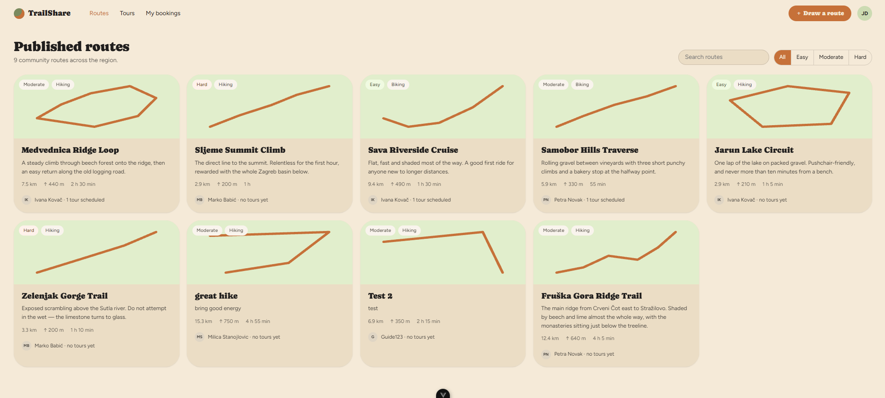

# TrailShare

**Draw the trail. Bring people along.**

A web app for drawing, sharing and discovering hiking and biking routes. Sketch a route on a map, tag how hard it is, and publish it. Guides schedule guided tours on published routes — hikers browse them and book a seat.

### 👉 [See the project page, with screenshots of every screen](https://milicastanojlovic.github.io/trail-share/)



---

## What it does

| | |
|---|---|
| **Draw & publish routes** | Click the map to drop waypoints and a line follows. Distance, elevation gain, estimated duration and waypoint count recompute live. Name it, mark it Easy / Moderate / Hard, pick hiking or biking, publish. |
| **Discover routes** | A catalog of every published route, each card showing a sparkline of its actual shape, its stats and its author. Search and the difficulty filter apply instantly, in the browser. |
| **Schedule guided tours** | Guides put a date, a start time, a capacity, a meeting point and a pace on any published route. |
| **Book a seat** | Hikers see how many seats are left and claim one. Seats can be released up to 24 h before the start. Nobody can double-book, and a tour can never be oversold. |
| **Guide dashboard** | Tours on the calendar, seats booked across all of them, routes published, and the roster of who is coming on each tour. |
| **Profiles** | Role, member-since, role-aware counters, published routes and booked or led tours. |

### Two roles, chosen once

The role is picked at registration and is fixed afterwards — the interface, the navigation and the API permissions all follow from it.

- **Guide** — publishes routes, schedules guided tours on them, sees the roster and the dashboard.
- **Hiker** — browses and publishes routes, books seats on guided tours, manages the seats they hold.

## Stack

**Frontend** — Vue 3 (Composition API, `<script setup>`) · TypeScript · Vite · Vue Router · Pinia · Leaflet on OpenStreetMap tiles
**Backend** — NestJS · TypeScript · TypeORM · PostgreSQL 16 · JWT + bcrypt · `class-validator`
**Tests** — Jest · Supertest · Testcontainers · Vitest

One Pinia store per domain owns its API calls and components never fetch; one NestJS module per domain feature owns its entity, DTOs, service and controller. Every request body, query and param goes through a validated DTO, and the schema is owned by migrations in every environment — there is no `synchronize` anywhere.

## Quick start

Needs Node `^22.18 || >=24.12` and any reachable PostgreSQL.

```bash
# 1. point the backend at a database
cp backend/.env.example backend/.env     # then fill in DATABASE_URL and DB_SSL

# 2. the API — applies pending migrations on boot, so an empty database is fine
cd backend && npm install && npm run start:dev        # http://localhost:8086/api/health

# 3. the app — Vite proxies /api through to the backend
cd frontend && npm install && npm run dev             # http://localhost:5173

# 4. the demo content (create-only and idempotent)
cd backend && npm run seed
```

Seeded sign-ins, all with the password `trailshare1`:

| Email | Role |
|---|---|
| `ivana@trailshare.hr` | Guide — publishes three routes |
| `luka@trailshare.hr` | Hiker |

## Tests

```bash
cd backend  && npm run lint && npm test && npm run test:e2e   # e2e needs Docker
cd frontend && npm run type-check && npm run build
```

The end-to-end suite runs against a throwaway PostgreSQL container and never touches the hosted database.

## Repository layout

```
backend/     NestJS API — one module per domain feature, migrations, seeder
frontend/    Vue 3 SPA — views, components, one Pinia store per domain
design/      the design source: TrailShare.dc.html + styles.css (read-only reference)
docs/        the project page (index.html), the design spec, seed data, screenshots
plans/       one checklist per feature slice
```

## About the build

TrailShare was built with [Claude Code](https://claude.com/claude-code) as eight feature slices — foundation & design system, auth & roles, route catalog, route drawing, tours, booking, profile, guide dashboard. Each slice is cut from `develop`, planned into a checklist in `plans/`, implemented task by task, reviewed and tested, then merged back with `--no-ff`. The interface is not improvised: it comes from a Claude Design project whose stylesheet — the warm sand palette, Caprasimo headings, pill-shaped controls — is the shared source of truth for the app.

## Notes on the demo

All content in the screenshots is seeded demo data. A few figures are placeholders rather than features: guide ratings are a hard-coded display stub, elevation gain is derived from distance and waypoint count rather than terrain data, and `PAID` is only a booking status — there is no payment flow.

Maps © [OpenStreetMap](https://www.openstreetmap.org/copyright) contributors.
